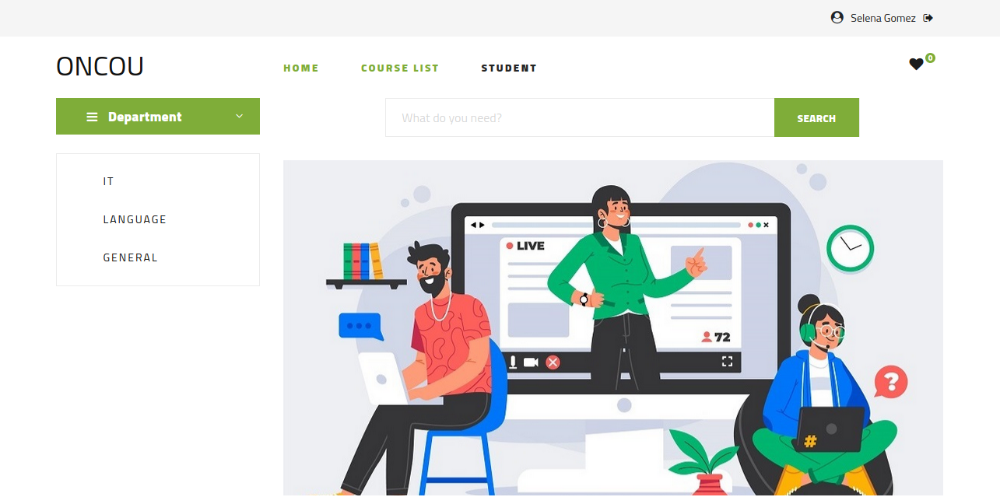
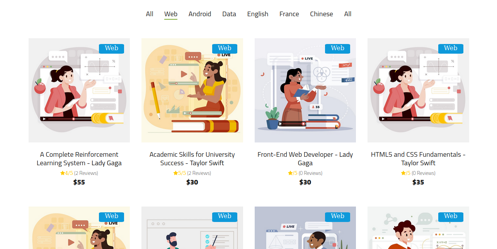

# online-course-website





## Introduce
-------------

Demo: [link](https://online-course-website.herokuapp.com/)     
Account:
- user: email2@gmail.com | 123
- teacher: email4@gmail.com | 123
- admin: email6@gmail.com | 123

## Tech stack
--------------
- nodejs
- express
- handlebar
- mysql

## Install
-----------
1. clone project
```bash
git clone https://github.com/phamvmnhut/online-course-website
cd online-course-website
```
2. Setup database       
create data schema : csdl.sql    
add sample data : insert.sql

3. Edit env file      
env help you set env in this local enviroment 
- copy sample.env file and rename it to .env
- edit info in this file to correct your inviroment
4. run project
- `npm start` : run with mode development
- `npm run pro` : run with mode production
- `npm run debug` : run with mode development and start debug [in ubuntuOS and macOS]
- `npm run debug-wins` : run with mode development and start debug [in WindowsOS]
- `npm run test` : test application

## Contributors ✨

<table>
  <tr>
    <td align="center"><a href="https://github.com/phamvmnhut"><br /><sub><b>Pham Van Minh Nhut</b></sub></a><br /><a href="#" title="Answering Questions">💬</a> <a href="#" title="Documentation">📖</a> <a href="#" title="Reviewed Pull Requests">👀</a> <a href="#" title="Talks">📢</a></td>
    <td align="center"><a href="https://github.com/caophuccp"><br /><sub><b>Cao Van Phuc</b></sub></a><br /><a href="#" title="Answering Questions">💬</a> <a href="#" title="Documentation">📖</a> <a href="#" title="Reviewed Pull Requests">👀</a> <a href="#" title="Talks">📢</a></td>
    <td align="center"><a href="https://github.com/kimngandinhphan"><br /><sub><b>Dinh Phan Kim Ngan</b></sub></a><br /><a href="#" title="Answering Questions">💬</a> <a href="#" title="Documentation">📖</a> <a href="#" title="Reviewed Pull Requests">👀</a> <a href="#" title="Talks">📢</a></td>
  </tr>
  </table>